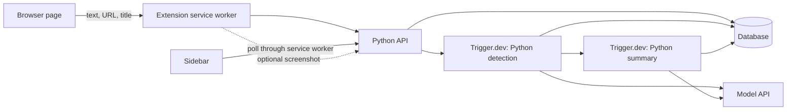

# Browser Task Sidebar — Backend Design

## 1. Confirmed scope

The extension helps users recover context across tabs by identifying tasks and summarizing where they left off.

Confirmed decisions:

- Page text plus URL/title is the primary input. Screenshots are an optional fallback.
- A model interprets generic page observations; separate detection rules for every website are unnecessary.
- Backend business logic is Python. The extension uses JavaScript/TypeScript.
- Trigger.dev handles detection and summary generation as background jobs.
- Anyone should be able to install and start using the extension through self-service onboarding.
- Tasks have In Progress, Needs Attention, Action Complete, or Error status. Needs Attention alone is sufficient; intervention buttons are deferred.
- Manual task addition, expandable summaries, and return-to-tab navigation are included. The app observes and summarizes; it does not execute actions.

The backend engineer owns the extension middle layer, including tab scanning, content extraction, service worker orchestration, API calls, credential storage, tab routing, optional screenshot capture, and scan persistence. The backend engineer also owns the Python API, persistence, model calls, Trigger.dev workflows, and anonymous installation identity boundary. Evelyn owns the sidebar UI and task cards. Framework, database hosting, and model provider remain proposals.

## 2. Architecture and normal flow

Proposed stack: Python HTTP API using FastAPI, PostgreSQL, Python model modules, and thin TypeScript Trigger.dev wrappers. Publish an OpenAPI contract for frontend integration. Model provider is undecided; OpenRouter remains excluded by the PRD.



1. After onboarding and permission setup, the extension enumerates open tabs and extracts bounded readable text from pages it can access.
2. It associates each observation with its URL, title, local tab mapping, and capture time. It records inaccessible pages separately instead of pretending they were analyzed.
3. The Python API validates and persists observations and submits a detection job, returning a scan ID.
4. Python detection code calls the model with the text, URL, and title. The model identifies a supported activity, describes the evidence, and proposes a status, or returns no task/insufficient evidence.
5. Valid detection results update tasks and trigger summary generation. The summary job writes one or two sentences describing the current visible state.
6. The sidebar polls persisted tasks. Clicking a task focuses its source tab. Closing the sidebar does not cancel submitted work.

Trigger.dev cannot read the user's browser directly. It processes observations already submitted by the extension. Its documented Python integration executes Python scripts from TypeScript wrappers; the Python API can submit jobs through HTTP. References: [Python integration](https://trigger.dev/docs/config/extensions/pythonExtension), [HTTP triggering](https://trigger.dev/docs/management/tasks/trigger).

## 3. Generic page extraction

Use a shared content script to collect readable rendered text, headings, and useful button/link labels. Prefer the main/article region when present; fall back to bounded body text. Remove repeated navigation, scripts, styles, hidden content, and excessive whitespace. Record whether text was truncated. Do not treat this extraction as a complete accessibility-tree snapshot.

Exclude input values and editable draft contents in the initial implementation. Do not collect cookies, browser storage, or full HTML. Visible page text may still include private messages and personal information; explain what is uploaded and provide pause and site exclusions. Draft detection will be limited without reading draft contents, which is an intentional initial tradeoff.

Proposed limits: 12,000 text characters per page, 20 observations per batch, and a 1 MB JSON request cap. Validate actual encoded byte size. These are application defaults to measure and tune. Preserve useful context when truncating; record extraction quality and errors.

Use URL/title alone for a broad hint if extraction fails, but do not infer detailed progress from metadata. Inaccessible, unloaded, frame-isolated, and visually rendered pages may yield little text. Generic extraction expands coverage without guaranteeing support for every website.

Start with Scan Now; add debounced refresh on navigation, activation, and meaningful content changes. Proposed debounce: two seconds. Hash normalized content plus URL/title to skip unchanged observations. Persist pending submissions and cached cards in extension storage so worker restarts do not lose them. Reference: [Chrome service worker lifecycle](https://developer.chrome.com/docs/extensions/develop/concepts/service-workers/lifecycle).

## 4. Optional screenshot fallback

The main flow must work without screenshots. Build and evaluate text extraction first.

Proposed fallback behavior:

1. Extraction yields little useful text, or detection returns insufficient evidence.
2. Offer an optional user-invoked screenshot capture for that page; do not automatically upload screenshots from every tab.
3. Capture the visible active page, verify its URL/tab still matches the requested source, and submit a new observation revision with an owned image reference.
4. Run detection again using a vision-capable model with the available text and screenshot. If evidence is still insufficient, retain that outcome rather than guessing.

A clear no-task result is not itself a reason to request a screenshot. Do not nag repeatedly for the same unchanged page. Capture the current text and image together as closely as possible; never combine a new screenshot with stale text from a different navigation.

Chrome's normal `captureVisibleTab` API captures the active tab's visible area, not all background tabs. Never cycle through tabs automatically to take screenshots. `activeTab` requires a qualifying user invocation; merely switching tabs does not grant access. References: [tabs API](https://developer.chrome.com/docs/extensions/reference/api/tabs), [activeTab](https://developer.chrome.com/docs/extensions/develop/concepts/activeTab).

Store fallback images privately, validate ownership and image type/size, and pass IDs to workers. Screenshots can expose information excluded by the text collector, so explain capture before upload. Proposed image limit: 5 MB. Retention is shared with raw observations below.

## 5. Permissions and public onboarding

Text extraction requires page access; tab metadata access alone is insufficient. Use extension storage, tabs, sidebar, and scripting capabilities as needed. Request host access through an explicit setup flow, with user-selected sites or broader coverage if the user enables it. The exact manifest and permission prompts need validation during extension implementation. Skip incognito and internal browser pages. Missing permission is a collection state, not a failed user task.

For MVP, public installation uses self-service anonymous installation identity issued by the backend. The extension stores the installation credential and sends it through the service worker for API requests. This keeps onboarding lightweight, but has limited recovery and no automatic cross-device account sharing. Auth0 is deferred. Manually issued demo credentials do not satisfy the public setup requirement.

Keep model, database, and Trigger.dev credentials server-side. Apply owner checks to every task, scan, observation, and image lookup, with rate limits and model-usage caps. Never trust a body-supplied owner ID. Public distribution and its data-use explanation must be completed before calling public installation finished; publishing is a separate action from writing this design.

## 6. Detection and status semantics

The model receives general instructions for supported categories: GitHub PR/issue work and docs/Stack Overflow research as the primary focus; email replies, travel, and shopping as personal categories. Each page is interpreted independently. Selected websites are evaluation examples, not a hardcoded support list.

Detection output uses a discriminated result:

- `task`: type, title, status, status reason, and evidence grounded in the submitted observation.
- `no_task`: sufficient content but no supported activity found.
- `insufficient_evidence`: reason the observation cannot establish an activity or state.

Only the task variant contains required task fields. Validate enums, lengths, and structure in Python. Page content is untrusted data; embedded instructions cannot override the system prompt, and the model receives no action tools.

| Status | Meaning |
| --- | --- |
| `in_progress` | Supported activity with no explicit completion or blocker evidence |
| `needs_attention` | An observed decision, blocker, or request for attention; include a reason |
| `action_complete` | Explicit evidence that the tracked activity/resource is complete, or manual completion |
| `error` | A visible error in the source workflow |

A merged PR can establish that the PR is merged; it does not prove the user personally completed a review. Describe the observed resource state. Tab closure never establishes completion. A generic checkout button alone does not establish a blocker.

Processing state is separate: `queued | running | ready | failed`. Model failure preserves the last valid task status and summary and displays a refresh error. Low-quality new observations retain existing task content with its last successful observation time. No-task results do not silently delete existing tasks.

Summary output is `{summary: string}` with at most two short sentences grounded in the observation and detection evidence. Manual tasks start In Progress and can be manually completed without model calls; their initial summary can restate the entered title.

## 7. Identity and persistence

Use UUID server IDs and UTC timestamps. Initially identify detected resources by an owner-scoped normalized URL. Normalize conservatively: retain resource-identifying query/fragment information, remove known tracking or credential fields, and avoid merging distinct pages. General cross-page grouping, such as itinerary to checkout, is outside the initial implementation.

Browser tab IDs stay in local browser-session mappings. Multiple tabs with the same source key map to one task. On click, verify the current tab URL before focusing it; if closed, offer to reopen the HTTP(S) source URL. Tasks remain after tab closure.

| Entity | Essential fields |
| --- | --- |
| Owner | ID, anonymous installation reference, created time |
| Source | Owner, source key, latest accepted observation ID/revision, observed time; unique owner/source key |
| Observation | ID, owner, source, revision, URL, title, text, extraction state, truncated flag, content hash, optional screenshot ID, capture time |
| Task | ID, owner, origin, nullable source key/URL, type, title, status/reason, summary, processing state/error, detection/summary revisions, observed/updated times |
| Scan | ID, owner, client request ID, state, counts, error; unique owner/client request ID |
| Scan item | Scan, observation, optional task, processing state, detection outcome/error |
| Image | ID, owner, private storage key, content type/size, expiry |

A Source exists before detection, allowing revision checks even when an older detection has not yet created a task. Detected tasks are unique by owner/source key; manual tasks have no source key.

Proposed retention: expire raw text and screenshots after 24 hours; keep task summaries until deletion. Provide deletion of a task and its retained source observations/images, and a clear-all flow. Re-observing an open page may recreate a deleted task; persistent dismissal is a later behavior to define. Do not log raw page text, images, or credentials.

## 8. API and frontend contract

The sidebar sends typed extension messages to the service worker, which owns HTTP requests and credentials. Share OpenAPI-generated types or checked fixtures with Evelyn.

| Endpoint | Purpose |
| --- | --- |
| `POST /v1/installations` | Issue an anonymous installation credential and create the owner boundary |
| `POST /v1/scans` | Submit client request ID and observations; return `202 {scan_id, state}` after enqueue |
| `GET /v1/scans/:id` | Return processing counts, per-item outcomes, and errors |
| `GET /v1/tasks` | Return owner-scoped task cards |
| `POST /v1/tasks` | Idempotent manual add using client request ID and title |
| `PATCH /v1/tasks/:id` | Edit manual task title/status |
| `POST /v1/tasks/:id/retry` | Retry latest retained observation; request new collection if expired |
| `POST /v1/images` | Optional authenticated bounded screenshot upload; return private image ID |
| `DELETE /v1/tasks/:id` | Delete task and associated retained observations/images |
| `DELETE /v1/data` | Clear the owner's task and observation data |

Observation input: `{client_observation_id, source_url, title, observed_at, text, extraction_state, truncated, screenshot_id?}`. The backend derives source identity and content hashes. Validate image ownership. Local tab IDs are unnecessary in backend payloads.

Task response: `{id, origin, source_key, source_url, type, title, status, status_reason, summary, processing_state, processing_error_code, observed_at, updated_at}`.

Errors: `{error: {code, message, retryable}}`. Use 400 for invalid input, 401 for missing/invalid anonymous installation credentials, 404 for absent or other-owner resources, and 429 for limits.

Extension messages: `SCAN_NOW`, `LIST_TASKS`, `ADD_MANUAL_TASK`, `UPDATE_MANUAL_TASK`, `RETRY_TASK`, `OPEN_TASK_SOURCE`, and optional `CAPTURE_FALLBACK`. Poll every two seconds while jobs are pending and the panel is open; back off when idle and stop on panel closure. Display last observation time and collection gaps separately from task status.

## 9. Workflow reliability

Persist submissions locally before sending and reuse the same request ID after network failure. The API records the scan then triggers detection with a stable idempotency key. A repeated request must resume incomplete dispatch, not assume an existing scan row proves a job was queued. Return a retryable error if dispatch fails and run repair for scans stuck before dispatch.

Assign source revisions when accepting observations, before model calls. Serialize source updates and reject older captures; observation time plus a stable tie-breaker defines initial ordering for this MVP. Compare with the latest content hash, so A -> B -> A is still a new revision. On worker completion, update a task only if the Source still points to that observation revision. Apply this guard to detection and summaries, including first-time task creation.

Persist accepted detection output before dispatching summaries. Retries resume pending summary dispatch even if detection already committed. Use task/revision idempotency keys and database uniqueness together. Every scan item reaches a terminal state, including superseded, no-task, insufficient-evidence, and failed items; scans must not spin forever.

Proposed retry policy: three attempts with exponential backoff for transient provider/network failures, bounded model timeouts, and no retries for invalid input. Tune timeouts after measuring text and vision calls. References: [Trigger.dev idempotency](https://trigger.dev/docs/idempotency), [retries](https://trigger.dev/docs/errors-retrying).

Deletion invalidates source revisions before cleanup so in-flight jobs cannot recreate deleted records from old observations. Respect site exclusions and clear pending local submissions when clearing data.

## 10. Suggested code layout

```text
apps/extension/src/
  background/           # BE-owned service worker, collection scheduling, API, credentials, tab routing
  collector/            # BE-owned generic text extraction and optional screenshot capture
  sidebar/              # Evelyn's UI
backend/app/
  routes/               # scans, tasks, images, anonymous installation identity
  schemas/              # observation and response models
  db/                   # migrations and transactional persistence
  detection/            # model prompts, output validation
  summarization/        # model calls and output validation
backend/jobs/           # Python entry points
contracts/              # OpenAPI and extension message contracts
trigger/
  detect-tasks.ts        # thin Python execution wrapper
  summarize-task.ts     # thin Python execution wrapper
trigger.config.ts       # Python packaging configuration
```

## 11. Implementation order and validation

1. Agree on API fixtures with Evelyn and build BE-owned text extraction/service worker -> Python API -> Trigger.dev detection -> summary -> sidebar.
2. Add manual tasks, tab navigation, recovery, and anonymous self-service onboarding.
3. Evaluate multiple developer and personal pages, including pages with no task and insufficient information.
4. Add optional screenshot fallback after text-path quality is measured. The core demo must work with screenshots disabled.
5. Complete public distribution preparation and test per-owner access and deletion.

Required checks: generic extraction excludes editable/hidden content; truncation preserves useful evidence; denied/inaccessible tabs remain understandable; duplicate submissions do not duplicate tasks; old detection and summary jobs cannot overwrite newer state; retries recover partial dispatch; closing/reopening the panel preserves results; tab switching cannot misassociate a screenshot; other-owner images and tasks cannot be accessed; deletion cannot be undone by an in-flight job.

Evaluate model accuracy against sanitized fixtures rather than testing exact summary wording. Record latency and model cost before enabling frequent automatic scans. Targets, not guarantees: completed text analysis within fifteen seconds under demo conditions. Label fixture/demo data explicitly.

## 12. Remaining decisions

- FastAPI acceptance, database hosting, and model provider/model.
- Initial host-permission scope and automatic refresh frequency.
- Text extraction thresholds and when to offer the optional screenshot fallback, based on evaluation.

The primary collection approach is settled: page text + URL/title first. This document specifies the design; application code and infrastructure have not been created.
